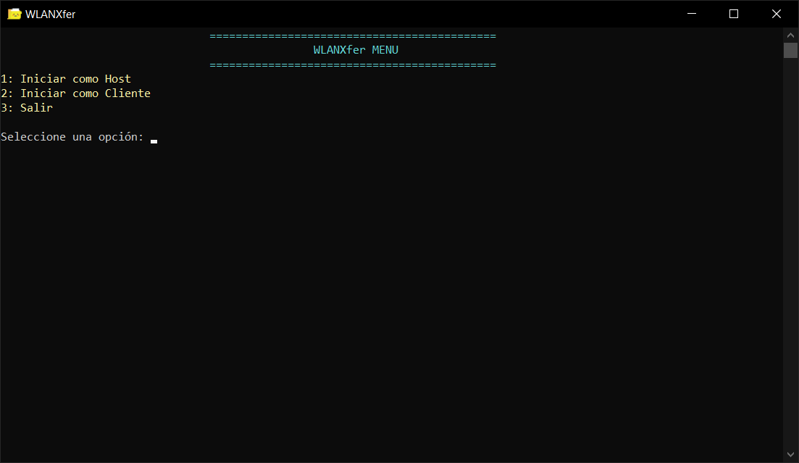

# WLANXfer

Una aplicación simple de transferencia de archivos utilizando un modelo cliente-servidor, con detección automática de cambios y revisiones periódicas de archivos. Solo disponible para Windows.

## Funcionalidades
- **Servidor**: Aloja un directorio y sirve archivos a los clientes.
- **Cliente**: Se conecta al servidor y verifica periódicamente si hay modificaciones en los archivos.
- **Minimizar al Tray**: El servidor puede minimizarse al área de notificación (tray) con una combinación de teclas (<kbd>Ctrl</kbd> + <kbd>Alt</kbd> + <kbd>Shift</kbd> + <kbd>W</kbd>).

## Descarga
Puedes descargar las últimas versiones compiladas del servidor y cliente desde la sección [Releases](https://github.com/otema666/WLANXfer/releases).

## Requisitos
- Visual Studio
- SDK de Windows 10+
- Biblioteca Winsock2

## Licencia
Este proyecto está bajo la licencia [MIT](https://github.com/otema666/WLANXfer/blob/master/LICENSE).

##

##
